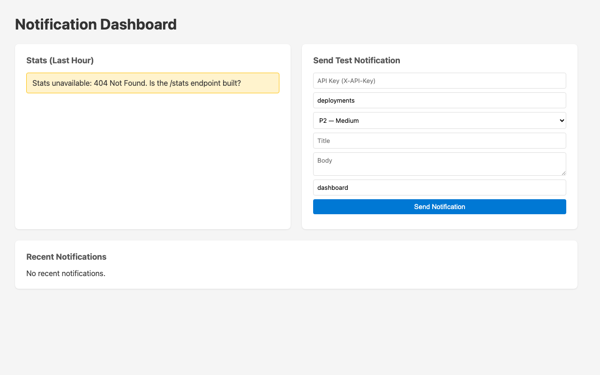

# Learn Claude Code Agent Teams

A hands-on exercise that teaches how Claude Code agent teams work — by showing they work exactly like human engineering teams.

You'll give a team of 4 AI agents a real feature request, watch them break it down, work in parallel on isolated branches, communicate, and ship — while you observe every step through an activity log.

## Prerequisites

**Required:**
- **Claude Code** installed and authenticated (`claude --version`)
- **Node.js** 18+ (`node --version`) — includes npm
- **Git** (`git --version`)
- **jq** (`jq --version`) — used by the observability hooks
- **Build tools** for native modules (better-sqlite3) — Mac: `xcode-select --install`, Windows: Visual Studio Build Tools
- **watch** *(optional)* — `watch -n 2 git worktree list` shows worktrees in a separate terminal if you want to see branches appear/disappear

**Optional:**
- **GitHub Copilot CLI** (`copilot --version`) — enables cross-model review step
- **Marp CLI** — auto-installed on first use of `/session-learnings` skill

> **Note:** Agent teams is an experimental feature. This project's `.claude/settings.json` enables it automatically via `CLAUDE_CODE_EXPERIMENTAL_AGENT_TEAMS`. No extra setup needed — just clone and go.

## Setup

```bash
git clone https://github.com/ktundwal/notify-service.git
cd notify-service
npm install
```

Verify the project works:

```bash
npm run verify
```

You should see 19 tests passing across 3 files. This is the starting state.

## The Exercise

### What you're building

notify-service is a Teams-style notification hub. Services push alerts (deploys, incidents, CI failures), engineers subscribe to channels, and it respects quiet hours.

Three features need to be added:
1. **Auth middleware** — API key validation on webhook routes
2. **Rate limiter** — 100 requests per minute per source, sliding window
3. **Stats endpoint** — notification counts by channel and priority

### The dashboard (starting state)

The repo ships with a notification dashboard at `http://localhost:3000/`. Before agents run, the `/stats` endpoint doesn't exist — the dashboard shows the gap clearly.



After agents build the features, stats populate, auth protects the send form, and rate limiting kicks in. The PO agent reviews this dashboard and writes a UX spec, then a dev agent implements the improvements.

### What makes this interesting

You won't write the code. You'll direct a team of 4 agents to build it — using the same workflow your engineering team uses: task breakdown, parallel work, isolated branches, acceptance criteria, and CI verification.

## Step-by-Step

### Step 1: See the spec (2 min)

Before agents touch anything, look at the acceptance tests — the spec you're giving them.

```bash
# Read the acceptance test file
cat tests/acceptance.test.ts

# Run them — all 27 should fail (the code doesn't exist yet)
npx vitest run tests/acceptance.test.ts
```

You'll see 27 failures. That's the starting line.

Now look at the dashboard — the UI the PO agent will review later:

```bash
npm run dev          # open http://localhost:3000 in your browser
```

Notice the stats panel shows a 404 error — the `/stats` endpoint doesn't exist yet. After agents build the features, everything lights up. Press `Ctrl+C` to stop the server when you're done looking.

### Step 2: Open two terminals side by side (1 min)

```
┌──────────────────────────────┐  ┌──────────────────────────────┐
│ Terminal 1:                   │  │ Terminal 2:                   │
│ Claude Code                   │  │ Activity Log                  │
│ (where agents work)          │  │ (observability)               │
└──────────────────────────────┘  └──────────────────────────────┘
```

> **Optional — Terminal 3 (Tutor):** If you get stuck, open a 3rd terminal and run `claude --agent tutor`. It's a read-only helper that explains concepts, interprets the activity log, and guides debugging — without writing code for you.

Split panes in iTerm2: `Cmd+D` (vertical split).

**Terminal 1:**
```bash
cd notify-service
> agent-activity.log       # clear any previous log
claude
```

**Terminal 2:**
```bash
cd notify-service
bash demo/observe.sh
```

Terminal 2 tails the activity log — task creation, agent spawns, file edits, and messages in real time.

### Step 3: Paste the prompt (1 min)

Copy the contents of `demo/prompt.txt` and paste it into Claude Code (Terminal 1).

The prompt asks Claude to:
- Create a team of 4 agents
- Each agent works in its own git worktree (isolated branch)
- Three agents build one feature each with unit tests
- A fourth agent writes an on-call playbook from the acceptance test spec
- After all three features finish, wire everything into server.ts
- After wiring, a librarian task updates CLAUDE.md with the new endpoints
- After wiring, a PO agent writes a UX spec, then a dev agent implements it
- Definition of done: `npm run verify` passes, including the acceptance tests

### Step 4: Watch (5-8 min)

This is where you observe. Here's what happens and what to look for:

**Phase 1 — Lead plans (~30s)**
The lead agent reads CLAUDE.md, explores the codebase, then creates tasks.
- Terminal 2 shows: `TASK+` lines (tasks being created)
- Look for: 8 tasks — #4 (wiring) blocked by #1, #2, #3; #5 (on-call playbook) has no blockers; #6 (librarian) and #7 (PO) blocked by #4; #8 (dashboard dev) blocked by #7

**Phase 2 — Agents spawn (~15s)**
Four agents start, each in its own git worktree.
- Terminal 2 shows: `SPAWN` lines
- Look for: 4 separate agents — 3 for features, 1 for the on-call playbook

**Phase 3 — Parallel work (~2 min)**
All four agents work simultaneously on different files.
- Terminal 2 shows: `WRITE` and `EDIT` lines with close timestamps
- Look for: auth.ts, rate-limiter.ts, stats.ts, and `docs/oncall-playbook.md` being written at the same time

**Phase 4 — Agents report back (~30s)**
As each agent finishes, it messages the lead.
- Terminal 1 shows: completion messages with test results
- Terminal 2 shows: `MSG` and `TASK✓` lines

**Phase 5 — Integration + Docs + UX (~2-3 min)**
Task #4 unblocks. The lead wires auth + rate limiter into server.ts. Then tasks #6 (librarian) and #7 (PO) unblock — CLAUDE.md gets updated and the PO writes a UX spec. Then task #8 (dashboard dev) unblocks and implements the PO's requirements.
- Terminal 2 shows: `TASK→ #4 in_progress`, then `EDIT server.ts`, then `EDIT CLAUDE.md`, then `WRITE demo-artifacts/ux-spec.md`, then `EDIT src/public/index.html`

**Phase 6 — Verification (~1 min)**
The lead runs `npm run verify`.
- Terminal 1 shows: all tests passing (including your 27 acceptance tests)
- Terminal 2 shows: `BASH` line for the verify command

**Phase 7 — Cross-model review *(optional, ~2 min)***
If Copilot CLI is installed, the lead runs `/crossmodel-review` on each feature file.
- Google and OpenAI models review the code independently
- The lead synthesizes feedback: agreements are high-confidence, disagreements need human judgment
- Real issues get fixed, false positives get documented

> Skip this phase if Copilot CLI isn't available. The exercise is complete after Phase 6.

### Step 5: Inspect the results

After Claude finishes, look at what was created:

```bash
# See all new and modified files
git status

# Check the acceptance tests pass
npx vitest run tests/acceptance.test.ts

# Look at what the agents wrote
cat src/middleware/auth.ts
cat src/services/rate-limiter.ts
cat src/routes/stats.ts
```

## Reset and Repeat

To go back to the starting state and run the exercise again:

```bash
# Exit Claude Code first
# Then:
bash demo/reset.sh
```

This reverts all file changes, removes files created by agents, and clears the activity log. You're back to 19 tests, 27 failing acceptance tests, ready to go again.

## What to Notice

### The 1:1 parallel with human teams

| How Your Team Works | How Agent Teams Work |
|---|---|
| New dev reads the wiki | Lead reads CLAUDE.md |
| Lead creates ADO items | TaskCreate → task list |
| Lead assigns to devs | TaskUpdate with owner |
| Each dev gets a feature branch | Each agent gets a git worktree |
| 3 devs work simultaneously | 4 agents write different files |
| On-call writes runbook from ticket | On-call agent writes playbook from acceptance tests |
| Dev posts in team channel | SendMessage → lead |
| Acceptance criteria in ADO item | tests/acceptance.test.ts |
| Work item closed, PR merged | TaskUpdate → completed |
| Blocked items unblock | blockedBy dependencies resolve |
| Docs updated after feature ships | Librarian updates CLAUDE.md after wiring |
| PO writes UX spec, dev implements | PO writes demo-artifacts/ux-spec.md → dev updates index.html |
| CI pipeline runs green | `npm run verify` passes |

### Six concepts to take away

1. **Acceptance tests = external quality gate.** Agents write their own unit tests (grading their own homework). The acceptance tests are YOUR spec — agents can't modify them, only satisfy them.

2. **Git worktrees = feature branches for agents.** Each agent gets an isolated copy of the repo. No file conflicts during parallel work. Changes merge back on completion.

3. **Hooks = observability.** The activity log isn't magic — it's a shell script that runs on every tool call. You can customize what gets logged, add alerts, or pipe to any monitoring system.

4. **Operational artifacts = on-call readiness.** The on-call agent reads the spec (acceptance tests) and writes a runbook — same as your on-call engineer documenting expected behavior before code ships. Operational readiness is part of development, not an afterthought.

5. **Docs are part of "done".** The librarian task updates CLAUDE.md after features are wired — if the API changed and the docs didn't, the work isn't finished. The acceptance tests verify that the docs reflect the current state of the code.

6. **PO→Dev handoff = cross-role collaboration.** The PO agent writes a UX spec, then a dev agent implements it. Same workflow as your product team: PO defines requirements, dev builds to spec. Agents aren't just coders — they fill any team role.

## Project Structure

```
notify-service/
├── docs/
│   └── oncall-playbook.md      ← on-call runbook (written by agent)
├── src/                        ← the application code
│   ├── public/index.html       ← notification dashboard (served at /)
│   ├── server.ts
│   ├── types/index.ts
│   ├── routes/
│   ├── services/
│   └── storage/
├── tests/
│   ├── acceptance.test.ts      ← YOUR spec (27 tests, do not modify)
│   ├── templates.test.ts       ← existing unit tests
│   ├── dedup.test.ts
│   └── dispatcher.test.ts
├── demo/
│   ├── prompt.txt              ← the exact prompt to paste
│   ├── observe.sh              ← tails the activity log
│   ├── reset.sh                ← reverts everything for a fresh run
│   └── README.md               ← detailed playbook (presenter notes)
├── hooks/
│   └── activity-logger.sh      ← the observability hook
├── scripts/
│   └── seed.ts                 ← populate sample data
├── .claude/
│   ├── settings.json           ← hook configuration (auto-enabled)
│   ├── agents/tutor.md         ← read-only tutor agent (claude --agent tutor)
│   ├── skills/crossmodel-review/ ← optional: peer review via Copilot CLI
│   ├── skills/session-learnings/ ← capture session learnings as artifacts
│   └── skills/marp-deck/        ← create presentations via Marp CLI
├── CLAUDE.md                   ← project context for Claude Code
├── deck.md                     ← Marp slide deck (tutorial)
└── package.json
```

## Need Help? Ask the Tutor

If you're stuck at any point, open a separate terminal and run:

```bash
claude --agent tutor
```

The tutor is a read-only agent that ships with this repo. It knows the tutorial structure, can read any file, and explains what's happening — but it won't write code for you. Ask it things like:
- "What are the 3 features being built?"
- "What does SPAWN mean in the activity log?"
- "My acceptance tests are failing — what should I check?"
- "Why didn't the agents use worktrees?"

## Capture & Share

After the exercise, capture what you learned:

```bash
# In Claude Code:
/session-learnings agent-teams-exercise
```

This produces a folder of portable artifacts:
- **README.md** — session summary
- **investigation-log.md** — what happened, what worked, what didn't
- **deck.md** — Marp presentation you can share with your team

The deck is presentation-ready — share it at your next team standup or brown bag. Each cohort's learnings compound when shared.

> Requires the `session-learnings` and `marp-deck` skills (shipped with this repo in `.claude/skills/`). Marp CLI is installed automatically on first use.

## Troubleshooting

**`npm install` fails on better-sqlite3**
This package requires native compilation. Make sure you have build tools:
- Windows: `npm install --global windows-build-tools` or install Visual Studio Build Tools
- Mac: `xcode-select --install`

**Hooks not logging (Terminal 2 stays empty)**
1. Check jq is installed: `jq --version`
2. Check the settings file exists: `cat .claude/settings.json`
3. Check the hook script is readable: `cat hooks/activity-logger.sh`
4. Make sure you started Claude Code FROM the project root (`cd notify-service && claude`), not a parent directory

**Agents don't spawn / Claude does it alone**
The prompt says "Create a team of 4 agents." If Claude handles it without a team, add: "Use a team of 4 agents to parallelize this."

**One agent stalls or errors**
Normal. Say "Continue" or let the lead reassign. Agents self-correct most of the time. If stuck, `/exit` and run `bash demo/reset.sh` to start fresh.

**`npm run verify` fails after agents finish**
Usually a wiring issue in server.ts. The lead should fix it automatically. If not, check:
- auth middleware imported and applied to `/webhooks` routes
- rate limiter imported and applied to `POST /webhooks/notify`
- stats route imported and registered at `/stats`

**Acceptance tests fail but unit tests pass**
The agents' code exists but doesn't match the spec. Check the error messages — they'll tell you exactly what's wrong (wrong status code, missing header, wrong response shape). The lead should iterate until acceptance tests pass.

**Want to see what the agents wrote?**
After the exercise, before resetting:
```bash
git diff                    # changes to existing files
git status                  # new files created
cat src/middleware/auth.ts   # read any specific file
```

**Want to try a different prompt?**
Edit `demo/prompt.txt` or type your own. The acceptance tests still define "done" regardless of how you phrase the request. Try being more or less specific and see how the output changes.
